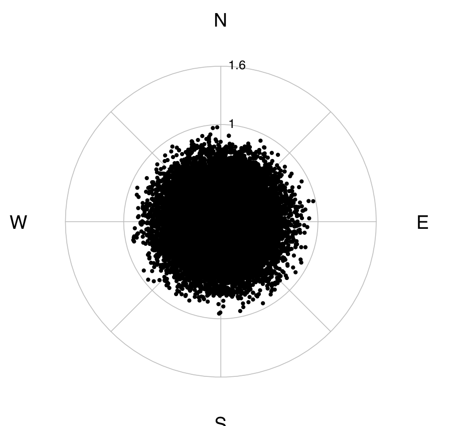

# cosmicrays
This is intended to simulate the distribution of **cosmic ray** coming throw **atmosphere**

#how to run
`make`

run: `./raggi.out`

note: you need **openMP** to run in multi proccessors machines.

#how it works
This generates many rays randomly through **all directions**, then the function:
``` fortran
real function Prob(esse)
real:: esse
real, parameter:: a = 1.2 !Factor to try
	Prob = 1 - e**(-a*esse)
end function
```
simulates the decadence caused by atmosphere.


#license
GPLv3
For further details see [LICENSE](LICENSE).
